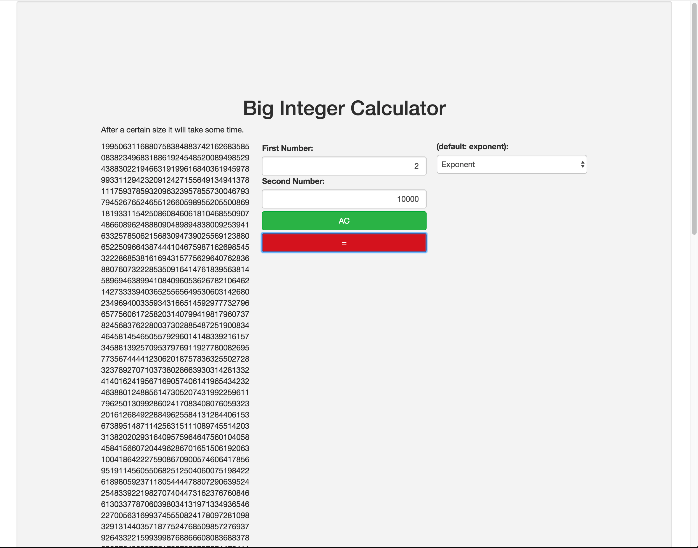

# Calculator

## Big Integer Multiplication and Exponents with High Precision

If you are tired of the scientific notation results you get from trying to multiply large numbers or find results for large exponents then try this! I've done numbers up to the 100,000th power. It takes a few minutes to complete the calculation, but it works! No scientific notation, just exact precise calculations.

## Simple Bootstrap Calculator

A bootstrap and javascript calculator with basic functionality.

## Technologies

* bootstrap
* jquery
* javascript

### More to come.

For now the "%" logic needs to be built and is currently disabled.
Future plans include scientific calculator functionality.
